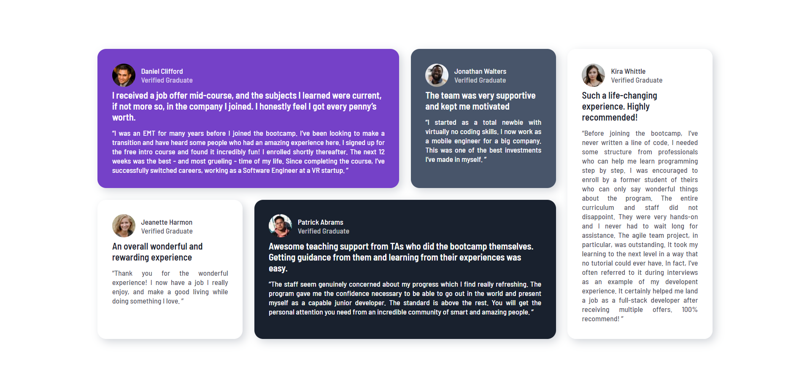

# Frontend Mentor - Seção de testemunhas utilizando o grid

Esse projeto foi baseado nesse: [Seção de testemunhas utilizando o grid](https://www.frontendmentor.io/challenges/testimonials-grid-section-Nnw6J7Un7). O site "Frontend Mentor" possui diversos desafios para melhorar as habilidades de programação com muitos projetos realistas.

## Visão Geral

## O desafio

O desafio consiste em posicionar as testemunhas de diversas pessoas utilizando grid e flexbox. Com isso será possível
que você melhore suas habilidades de Front-End, onde você também pode acrescentar coisas ao decorrer do projeto
como utilizar o JS.

## Screenshot

- O meu projeto final



## Links

- MDN: [MDN](https://developer.mozilla.org/pt-BR/docs/Web/CSS/CSS_Grid_Layout)
- Google Fonts: [google fonts](https://fonts.google.com/specimen/Barlow+Semi+Condensed?query=Barlow)

#

## Meu Progresso

### Tecnologias utilizadas

- Semantic HTML5 markup
- CSS custom properties
- Flexbox
- CSS Grid

## O que eu aprendi?

Com esse projeto, eu consegui expandir meu conhecimento relacionado as tecnologias de Grid e Flexbox. Como por exemplo, as posições do grid.

```css
.grid{
    grid-column: 2 / 4;
    grid-row: 2/ 3;
}

.colors{
  color: hsl(263, 55%, 52%);
  color: hsl(217, 19%, 35%);
  color: hsl(219, 29%, 14%);
  color: hsl(0, 0%, 100%);
}
```

#

## Recursos úteis

- [MDN Web Docs](https://developer.mozilla.org/pt-BR/docs/Web/CSS/CSS_Grid_Layout) - O MDN me ajudou a compreender melhor o posicionamento dos grids

## Autor

- GitHub - [PedroHBitencourt](https://github.com/PedroHBitencourt)
- E-mail - pedro.bitencourt.dev@gmail.com
- Twitter - [Pedro Henrique Bitencourt Dias](https://www.linkedin.com/in/pedro-henrique-bitencourt-dias-704a65170/)